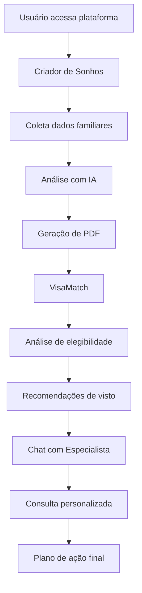

# DOCUMENTAÇÃO DO PROJETO LIFEWAY USA JOURNEY

**Versão:** 1.80  
**Data:** 01/08/2025  
**Autor:** Equipe LifeWay  

---

## 📋 ÍNDICE

1. [Visão Geral do Projeto](#visão-geral-do-projeto)
2. [Arquitetura do Sistema](#arquitetura-do-sistema)
3. [Ferramentas Principais](#ferramentas-principais)
4. [Algoritmos Detalhados](#algoritmos-detalhados)
5. [Recursos e Funcionalidades](#recursos-e-funcionalidades)
6. [Fluxos de Dados](#fluxos-de-dados)
7. [Integração com IA](#integração-com-ia)
8. [Sistema de Monetização](#sistema-de-monetização)

---

## 🎯 VISÃO GERAL DO PROJETO

### Objetivo
O LifeWay USA Journey é uma plataforma completa para auxiliar famílias brasileiras no processo de imigração para os Estados Unidos, oferecendo ferramentas inteligentes de análise, planejamento e consultoria especializada.

### Missão
Democratizar o acesso a informações precisas sobre imigração americana, fornecendo análises personalizadas e suporte especializado para maximizar as chances de sucesso no processo imigratório.

### Público-Alvo
- Famílias interessadas em imigrar para os EUA
- Profissionais qualificados buscando oportunidades de trabalho
- Investidores interessados em vistos de investimento
- Estudantes e pesquisadores acadêmicos

---

## 🏗️ ARQUITETURA DO SISTEMA

### Stack Tecnológico

#### Frontend
- **React 18** com TypeScript
- **Vite** como bundler
- **Tailwind CSS** para estilização
- **Radix UI** para componentes base
- **Lucide React** para ícones
- **React Query** para gerenciamento de estado
- **React Router** para navegação

#### Backend
- **Supabase** ou outra opçao que possibilite o uso de banco de dados como Backend-as-a-Service
- **PostgreSQL** como banco de dados principal
- **Supabase Storage** ou outro storage para arquivos e imagens
- **OpenAI API** para análises de IA

#### Integrações
- **OpenAI GPT-4** para análises inteligentes
- **OpenAI Assistant API** para chat especializado
- **React-PDF** para geração de relatórios
- **Socket.io** para chat em tempo real

###  Estrutura base para deploy

admin-panel, api, frontend, database e storage

### Estrutura de Diretórios
```
src/
├── components/           # Componentes React
│   ├── forms/           # Formulários específicos
│   ├── ui/              # Componentes de interface
│   └── UserContextManager.tsx
├── hooks/               # Hooks customizados
├── services/            # Serviços de API
├── types/               # Definições TypeScript
├── utils/               # Utilitários
└── pages/               # Páginas da aplicação
```

---

## 🛠️ FERRAMENTAS PRINCIPAIS

## 1. CRIADOR DE SONHOS

### Descrição
Ferramenta interativa que ajuda famílias a visualizar e planejar cenários de vida nos Estados Unidos, criando um roadmap personalizado para seus objetivos de imigração.

### Funcionalidades Principais
- **Formulário Multistep**: Coleta progressiva de informações familiares
- **Análise de IA**: Processamento inteligente dos dados com OpenAI
- **Geração de PDF**: Relatório visual elegante com cenários personalizados
- **Sistema de Monetização**: Controle de acesso baseado em período e tipo de usuário

### Algoritmo Detalhado

#### Fase 1: Coleta de Dados
```typescript
interface CriadorSonhosAlgorithm {
  // 1. Coleta de Informações Pessoais
  collectPersonalInfo(): PersonalData {
    return {
      familyComposition: getFamilyMembers(),
      currentSituation: getCurrentLifestyle(),
      professionalProfile: getProfessionalData(),
      financialStatus: getFinancialOverview()
    }
  }

  // 2. Definição de Objetivos
  defineGoals(): ImmigrationGoals {
    return {
      primaryObjective: getMainGoal(),
      timeline: getDesiredTimeline(),
      targetLocation: getPreferredStates(),
      lifestyle: getDesiredLifestyle()
    }
  }

  // 3. Análise de Situação Atual
  analyzeCurrent(): CurrentAnalysis {
    return {
      strengths: identifyStrengths(),
      challenges: identifyObstacles(),
      resources: assessAvailableResources(),
      readiness: calculateReadinessScore()
    }
  }
}
```

#### Fase 2: Processamento com IA
```typescript
interface AIProcessing {
  // 1. Preparação do Prompt
  preparePrompt(data: FormData): string {
    const prompt = `
      ANÁLISE FAMILIAR PARA IMIGRAÇÃO USA
      
      PERFIL FAMILIAR:
      ${formatFamilyProfile(data)}
      
      OBJETIVOS:
      ${formatGoals(data)}
      
      SITUAÇÃO ATUAL:
      ${formatCurrentSituation(data)}
      
      GERE:
      1. Visão Geral da Família
      2. Mapeamento de Sonhos
      3. 3 Cenários de Transformação
      4. Timeline de Fases
      5. Ferramentas Práticas
    `;
    return prompt;
  }

  // 2. Processamento OpenAI
  async processWithAI(prompt: string): Promise<AIAnalysis> {
    const response = await openai.chat.completions.create({
      model: "gpt-4-turbo-preview",
      messages: [{ role: "user", content: prompt }],
      temperature: 0.7,
      max_tokens: 4000
    });
    
    return parseAIResponse(response.choices[0].message.content);
  }
}
```

#### Fase 3: Geração de PDF
```typescript
interface PDFGeneration {
  // 1. Seleção de Imagens
  selectFamilyImages(familyProfile: FamilyData): string[] {
    const imagePool = getFamilyImages();
    return smartImageSelection({
      familySize: familyProfile.members.length,
      ageGroups: familyProfile.ageDistribution,
      lifestyle: familyProfile.currentLifestyle,
      targetLifestyle: familyProfile.desiredLifestyle
    });
  }

  // 2. Estruturação do Conteúdo
  structureContent(aiAnalysis: AIAnalysis): PDFStructure {
    return {
      coverPage: createCoverPage(),
      familyOverview: createFamilySection(),
      dreamMapping: createDreamSection(),
      scenarios: createScenariosSection(),
      timeline: createTimelineSection(),
      tools: createToolsSection(),
      nextSteps: createActionPlan()
    };
  }

  // 3. Renderização
  async generatePDF(structure: PDFStructure): Promise<Buffer> {
    return await PDFDocument.create({
      template: 'elegant-family-report',
      data: structure,
      images: selectedImages,
      styling: modernFamilyTheme
    });
  }
}
```

---

## 2. VISAMATCH

### Descrição
Sistema inteligente de análise de perfil familiar para recomendação de estratégias de visto americano, utilizando OpenAI Assistant para análises técnicas precisas.

### Funcionalidades Principais
- **Análise de Perfil**: Avaliação completa da elegibilidade familiar
- **Recomendações Inteligentes**: 3 estratégias viáveis ranqueadas por viabilidade
- **Pontuação de Compatibilidade**: Score de match para cada tipo de visto
- **Plano de Ação**: Passos específicos para cada estratégia

### Algoritmo Detalhado

#### Fase 1: Preparação de Dados
```typescript
interface VisaMatchAlgorithm {
  // 1. Estruturação de Dados do Cliente
  structureClientData(formData: any): ClientProfile {
    return {
      personalInfo: {
        age: formData.age,
        education: formData.education,
        profession: formData.profession,
        experience: formData.experience,
        englishLevel: formData.englishLevel
      },
      familyInfo: {
        maritalStatus: formData.maritalStatus,
        children: formData.children,
        dependents: formData.dependents
      },
      financialInfo: {
        currentIncome: formData.income,
        savings: formData.savings,
        investmentCapacity: formData.investment
      },
      professionalInfo: {
        currentRole: formData.currentJob,
        skills: formData.skills,
        certifications: formData.certifications,
        workExperience: formData.workHistory
      }
    };
  }

  // 2. Análise de Elegibilidade Prévia
  preAnalyzeEligibility(profile: ClientProfile): EligibilityMatrix {
    const eligibilityScores = {
      EB1: calculateEB1Score(profile),
      EB2: calculateEB2Score(profile),
      EB3: calculateEB3Score(profile),
      EB5: calculateEB5Score(profile),
      L1: calculateL1Score(profile),
      H1B: calculateH1BScore(profile),
      O1: calculateO1Score(profile)
    };
    
    return rankByViability(eligibilityScores);
  }
}
```

#### Fase 2: Processamento com OpenAI Assistant
```typescript
interface AssistantProcessing {
  // 1. Configuração do Assistant
  setupAssistant(): OpenAIAssistant {
    return openai.beta.assistants.create({
      name: "VisaMatch Specialist",
      instructions: `
        Você é um especialista em imigração americana com 15+ anos de experiência.
        Analise perfis familiares e recomende as 3 melhores estratégias de visto.
        
        ESTRUTURA DE ANÁLISE:
        1. Avaliação de Elegibilidade
        2. Análise de Viabilidade
        3. Três Estratégias Principais
        4. Comparação Detalhada
        5. Plano de Ação
        6. Recursos Especializados
        7. Timeline Realista
      `,
      model: "gpt-4-turbo-preview",
      tools: [
        { type: "code_interpreter" },
        { type: "retrieval" }
      ]
    });
  }

  // 2. Processamento da Análise
  async processAnalysis(clientData: ClientProfile): Promise<VisaAnalysis> {
    const thread = await openai.beta.threads.create();
    
    await openai.beta.threads.messages.create(thread.id, {
      role: "user",
      content: formatClientDataForAnalysis(clientData)
    });

    const run = await openai.beta.threads.runs.create(thread.id, {
      assistant_id: this.assistantId
    });

    const result = await waitForCompletion(run);
    return parseVisaAnalysis(result);
  }
}
```

#### Fase 3: Estruturação de Resultados
```typescript
interface ResultStructuring {
  // 1. Ranking de Estratégias
  rankStrategies(analysis: RawAnalysis): VisaStrategy[] {
    return analysis.strategies
      .map(strategy => ({
        ...strategy,
        viabilityScore: calculateViabilityScore(strategy),
        timelineScore: calculateTimelineScore(strategy),
        costScore: calculateCostScore(strategy),
        complexityScore: calculateComplexityScore(strategy)
      }))
      .sort((a, b) => b.overallScore - a.overallScore)
      .slice(0, 3);
  }

  // 2. Geração de Planos de Ação
  generateActionPlans(strategies: VisaStrategy[]): ActionPlan[] {
    return strategies.map(strategy => ({
      strategyId: strategy.id,
      phases: [
        {
          phase: "Preparação",
          duration: "1-3 meses",
          tasks: generatePreparationTasks(strategy),
          milestones: generatePreparationMilestones(strategy)
        },
        {
          phase: "Documentação",
          duration: "2-6 meses", 
          tasks: generateDocumentationTasks(strategy),
          milestones: generateDocumentationMilestones(strategy)
        },
        {
          phase: "Aplicação",
          duration: "1-12 meses",
          tasks: generateApplicationTasks(strategy),
          milestones: generateApplicationMilestones(strategy)
        }
      ]
    }));
  }
}
```

---

## 3. CHAT COM ESPECIALISTA

### Descrição
Sistema de chat em tempo real que conecta usuários com especialistas em imigração, utilizando contexto completo do usuário para consultas personalizadas.

### Funcionalidades Principais
- **Chat em Tempo Real**: Comunicação instantânea via WebSocket
- **Contexto Inteligente**: Acesso completo ao histórico do usuário
- **Transferência de Contexto**: Dados do VisaMatch e Criador de Sonhos
- **Histórico Persistente**: Armazenamento de todas as conversas

### Algoritmo Detalhado

#### Fase 1: Preparação de Contexto
```typescript
interface SpecialistChatAlgorithm {
  // 1. Agregação de Contexto do Usuário
  async aggregateUserContext(userId: string): Promise<UserContext> {
    const context = await Promise.all([
      getUserProfile(userId),
      getDreamAnalysis(userId),
      getVisaMatchResults(userId),
      getPreviousInteractions(userId)
    ]);

    return {
      profile: context[0],
      dreams: context[1],
      visaAnalysis: context[2],
      history: context[3],
      contextScore: calculateContextCompleteness(context)
    };
  }

  // 2. Preparação para Especialista
  prepareSpecialistContext(userContext: UserContext): SpecialistBrief {
    return {
      clientSummary: generateClientSummary(userContext),
      keyInsights: extractKeyInsights(userContext),
      recommendedFocus: suggestFocusAreas(userContext),
      potentialConcerns: identifyPotentialIssues(userContext),
      previousRecommendations: getPreviousAdvice(userContext)
    };
  }
}
```

#### Fase 2: Gerenciamento de Chat
```typescript
interface ChatManagement {
  // 1. Inicialização da Sessão
  async initializeChatSession(userId: string, specialistId: string): Promise<ChatSession> {
    const session = await ChatSession.create({
      userId,
      specialistId,
      startTime: new Date(),
      context: await this.aggregateUserContext(userId),
      status: 'active'
    });

    // Notificar especialista com contexto
    await this.notifySpecialist(specialistId, {
      newClient: true,
      clientBrief: await this.prepareSpecialistContext(session.context),
      urgency: calculateUrgency(session.context)
    });

    return session;
  }

  // 2. Processamento de Mensagens
  async processMessage(sessionId: string, message: ChatMessage): Promise<void> {
    // Salvar mensagem
    await this.saveMessage(sessionId, message);

    // Análise de sentimento e intenção
    const analysis = await this.analyzeMessage(message);

    // Sugestões automáticas para especialista
    if (message.sender === 'user') {
      const suggestions = await this.generateSpecialistSuggestions(
        message.content,
        analysis,
        await this.getSessionContext(sessionId)
      );
      
      await this.sendSpecialistSuggestions(sessionId, suggestions);
    }

    // Atualizar métricas da sessão
    await this.updateSessionMetrics(sessionId, analysis);
  }
}
```

#### Fase 3: Análise e Follow-up
```typescript
interface ChatAnalytics {
  // 1. Análise de Sessão
  async analyzeSession(sessionId: string): Promise<SessionAnalysis> {
    const session = await this.getSession(sessionId);
    const messages = await this.getSessionMessages(sessionId);

    return {
      duration: session.endTime - session.startTime,
      messageCount: messages.length,
      topicsDiscussed: extractTopics(messages),
      issuesResolved: identifyResolvedIssues(messages),
      actionItemsCreated: extractActionItems(messages),
      clientSatisfaction: calculateSatisfactionScore(session),
      specialistPerformance: evaluateSpecialistPerformance(messages)
    };
  }

  // 2. Geração de Follow-up
  async generateFollowUp(sessionId: string): Promise<FollowUpPlan> {
    const analysis = await this.analyzeSession(sessionId);
    
    return {
      summaryReport: generateSessionSummary(analysis),
      actionItems: prioritizeActionItems(analysis.actionItemsCreated),
      nextSteps: recommendNextSteps(analysis),
      scheduledFollowUp: calculateFollowUpDate(analysis),
      resourceRecommendations: suggestResources(analysis.topicsDiscussed)
    };
  }
}
```

---

## 4. SISTEMA DE CONTEXTO JSON

### Descrição
Sistema centralizado de gerenciamento de dados do usuário que mantém um contexto unificado e estruturado para todas as ferramentas e interações com IA.

### Funcionalidades Principais
- **Contexto Unificado**: Estrutura JSON padronizada para todos os dados
- **Versionamento**: Controle de versões do contexto do usuário
- **Sincronização**: Atualização em tempo real entre ferramentas
- **Análise de Completude**: Score de completude dos dados

### Algoritmo Detalhado

#### Fase 1: Estruturação de Dados
```typescript
interface ContextManagement {
  // 1. Inicialização do Contexto
  async initializeUserContext(userId: string): Promise<UserContext> {
    const baseContext: UserContext = {
      context_id: generateUUID(),
      user_id: userId,
      version: 1,
      created_at: new Date().toISOString(),
      updated_at: new Date().toISOString(),
      last_accessed: new Date().toISOString(),
      
      profile: await this.initializeProfile(userId),
      immigration_goals: this.initializeGoals(),
      current_situation: this.initializeSituation(),
      dream_goals: [],
      visa_analyses: [],
      specialist_interactions: [],
      progress_tracking: this.initializeProgress(),
      ai_insights: this.initializeInsights(),
      
      data_completeness_score: 0,
      privacy_settings: this.getDefaultPrivacySettings(),
      tags: [],
      notes: []
    };

    return await this.saveContext(baseContext);
  }

  // 2. Atualização Incremental
  async updateContext(
    userId: string, 
    updates: Partial<UserContext>
  ): Promise<UserContext> {
    const currentContext = await this.getContext(userId);
    
    const updatedContext = {
      ...currentContext,
      ...updates,
      version: currentContext.version + 1,
      updated_at: new Date().toISOString(),
      data_completeness_score: this.calculateCompleteness({
        ...currentContext,
        ...updates
      })
    };

    // Validar integridade dos dados
    const validation = await this.validateContext(updatedContext);
    if (!validation.isValid) {
      throw new Error(`Context validation failed: ${validation.errors.join(', ')}`);
    }

    return await this.saveContext(updatedContext);
  }
}
```

#### Fase 2: Análise de Completude
```typescript
interface CompletenessAnalysis {
  // 1. Cálculo de Score de Completude
  calculateCompleteness(context: UserContext): number {
    const weights = {
      profile: 0.25,
      immigration_goals: 0.20,
      current_situation: 0.15,
      dream_goals: 0.15,
      visa_analyses: 0.15,
      specialist_interactions: 0.10
    };

    let totalScore = 0;

    // Profile completeness
    totalScore += weights.profile * this.calculateProfileCompleteness(context.profile);
    
    // Goals completeness
    totalScore += weights.immigration_goals * this.calculateGoalsCompleteness(context.immigration_goals);
    
    // Situation completeness
    totalScore += weights.current_situation * this.calculateSituationCompleteness(context.current_situation);
    
    // Dreams completeness
    totalScore += weights.dream_goals * (context.dream_goals.length > 0 ? 1 : 0);
    
    // Visa analysis completeness
    totalScore += weights.visa_analyses * (context.visa_analyses.length > 0 ? 1 : 0);
    
    // Specialist interactions
    totalScore += weights.specialist_interactions * Math.min(context.specialist_interactions.length / 3, 1);

    return Math.round(totalScore * 100);
  }

  // 2. Identificação de Dados Faltantes
  identifyMissingData(context: UserContext): string[] {
    const missing: string[] = [];

    // Profile gaps
    if (!context.profile.education_level) missing.push('Nível de educação');
    if (!context.profile.english_level) missing.push('Nível de inglês');
    if (!context.profile.experience_years) missing.push('Anos de experiência');

    // Goals gaps
    if (!context.immigration_goals.timeline) missing.push('Timeline de imigração');
    if (!context.immigration_goals.target_states?.length) missing.push('Estados de interesse');

    // Situation gaps
    if (!context.current_situation.employment_status) missing.push('Status de emprego');
    if (!context.current_situation.available_funds) missing.push('Recursos financeiros');

    return missing;
  }
}
```

---

## 5. SISTEMA DE MONETIZAÇÃO

### Descrição
Sistema inteligente de controle de acesso que implementa a estratégia de monetização do PDF do Criador de Sonhos, oferecendo 60 dias gratuitos seguidos de acesso exclusivo para usuários PRO.

### Algoritmo de Monetização

```typescript
interface MonetizationSystem {
  // 1. Verificação de Elegibilidade para PDF
  async checkPDFAccess(userId: string): Promise<PDFAccessResult> {
    const user = await this.getUser(userId);
    const launchDate = new Date('2025-08-01'); // Data de lançamento
    const currentDate = new Date();
    const daysSinceLaunch = Math.floor((currentDate.getTime() - launchDate.getTime()) / (1000 * 60 * 60 * 24));

    // Período gratuito (60 dias)
    if (daysSinceLaunch <= 60) {
      return {
        hasAccess: true,
        accessType: 'free_period',
        daysRemaining: 60 - daysSinceLaunch,
        message: `Acesso gratuito disponível por mais ${60 - daysSinceLaunch} dias`
      };
    }

    // Após período gratuito - apenas PRO
    if (user.subscription_type === 'PRO') {
      return {
        hasAccess: true,
        accessType: 'pro_subscription',
        message: 'Acesso liberado para usuário PRO'
      };
    }

    // Usuário FREE após período gratuito
    return {
      hasAccess: false,
      accessType: 'upgrade_required',
      message: 'Upgrade para PRO necessário para acessar o PDF',
      upgradeUrl: '/upgrade-to-pro'
    };
  }

  // 2. Interface de Controle de Acesso
  async renderPDFAccessControl(userId: string): Promise<React.Component> {
    const accessResult = await this.checkPDFAccess(userId);

    if (accessResult.hasAccess) {
      return (
        <PDFDownloadButton 
          userId={userId}
          accessType={accessResult.accessType}
        />
      );
    }

    return (
      <PDFUpgradePrompt
        message={accessResult.message}
        upgradeUrl={accessResult.upgradeUrl}
        benefits={[
          'Acesso ilimitado ao PDF do Criador de Sonhos',
          'Análises avançadas do VisaMatch',
          'Chat prioritário com especialistas',
          'Relatórios personalizados mensais'
        ]}
      />
    );
  }
}
```

---

## 📊 FLUXOS DE DADOS

### Fluxo Principal do Usuário



### Fluxo de Dados entre Componentes

```typescript
interface DataFlow {
  // 1. Criador de Sonhos → Contexto do Usuário
  dreamsToContext(formData: CriadorSonhosFormData): ContextUpdate {
    return {
      operation: 'update',
      section: 'dream_goals',
      data: {
        form_data: formData,
        status: 'completed',
        created_at: new Date().toISOString()
      },
      source: 'user'
    };
  }

  // 2. VisaMatch → Contexto do Usuário
  visaMatchToContext(analysis: VisaAnalysis): ContextUpdate {
    return {
      operation: 'append',
      section: 'visa_analyses',
      data: analysis,
      source: 'ai'
    };
  }

  // 3. Chat → Contexto do Usuário
  chatToContext(interaction: SpecialistInteraction): ContextUpdate {
    return {
      operation: 'append',
      section: 'specialist_interactions',
      data: interaction,
      source: 'specialist'
    };
  }
}
```

---

## 🤖 INTEGRAÇÃO COM IA

### OpenAI GPT-4 (Criador de Sonhos)

#### Configuração
```typescript
const openaiConfig = {
  model: "gpt-4-turbo-preview",
  temperature: 0.7,
  max_tokens: 4000,
  top_p: 1,
  frequency_penalty: 0,
  presence_penalty: 0
};
```

#### Prompt Engineering
```typescript
const dreamCreatorPrompt = `
Você é um consultor especializado em imigração familiar para os Estados Unidos.
Sua missão é ajudar famílias brasileiras a visualizar e planejar sua jornada de imigração.

COM BASE NOS DADOS FORNECIDOS, CRIE:

1. **VISÃO GERAL DA FAMÍLIA**
   - Perfil familiar atual
   - Pontos fortes identificados
   - Desafios a superar

2. **MAPEAMENTO DE SONHOS**
   - Objetivos principais da família
   - Motivações profundas
   - Visão de futuro nos EUA

3. **TRÊS CENÁRIOS DE TRANSFORMAÇÃO**
   - Cenário Conservador (2-3 anos)
   - Cenário Realista (1-2 anos)
   - Cenário Acelerado (6-12 meses)

4. **TIMELINE DE FASES**
   - Preparação (0-6 meses)
   - Execução (6-18 meses)
   - Estabelecimento (18-36 meses)

5. **FERRAMENTAS PRÁTICAS**
   - Checklist de documentos
   - Recursos recomendados
   - Próximos passos específicos

Tom: Inspirador, prático e personalizado para a família.
`;
```

### OpenAI Assistant (VisaMatch)

#### Configuração do Assistant
```typescript
const assistantConfig = {
  name: "VisaMatch Immigration Specialist",
  instructions: `
    Você é um especialista em imigração americana com 15+ anos de experiência.
    Analise perfis familiares e recomende estratégias de visto viáveis.
    
    METODOLOGIA DE ANÁLISE:
    1. Avaliação de elegibilidade técnica
    2. Análise de viabilidade prática
    3. Ranking por probabilidade de sucesso
    4. Consideração de timeline e custos
    5. Identificação de riscos e mitigações
    
    ESTRUTURA DE RESPOSTA:
    - Análise de Elegibilidade
    - Três Estratégias Principais (ranqueadas)
    - Comparação Detalhada
    - Planos de Ação Específicos
    - Timeline Realista
    - Recursos Especializados
  `,
  model: "gpt-4-turbo-preview",
  tools: [
    { type: "code_interpreter" },
    { type: "retrieval" }
  ]
};
```

---

## 💰 SISTEMA DE MONETIZAÇÃO DETALHADO

### Estratégia de Conversão

#### Fase 1: Período Gratuito (60 dias)
```typescript
interface FreeTrialStrategy {
  objectives: [
    "Capturar leads qualificados",
    "Demonstrar valor da plataforma",
    "Coletar feedback dos usuários",
    "Construir base de dados"
  ];
  
  features: [
    "Acesso completo ao Criador de Sonhos",
    "Download ilimitado de PDFs",
    "Análise básica do VisaMatch",
    "Chat limitado com especialista (30 min)"
  ];
  
  conversionTactics: [
    "Email marketing personalizado",
    "Notificações in-app sobre benefícios PRO",
    "Webinars exclusivos para usuários ativos",
    "Desconto especial nos últimos 7 dias"
  ];
}
```

#### Fase 2: Modelo PRO
```typescript
interface ProSubscriptionModel {
  pricing: {
    monthly: "$97/mês",
    annual: "$997/ano (2 meses grátis)",
    lifetime: "$2997 (pagamento único)"
  };
  
  features: [
    "PDF ilimitado do Criador de Sonhos",
    "Análises avançadas do VisaMatch",
    "Chat ilimitado com especialistas",
    "Relatórios mensais personalizados",
    "Acompanhamento de progresso",
    "Acesso a webinars exclusivos",
    "Suporte prioritário 24/7"
  ];
  
  valueProposition: {
    timesSaved: "200+ horas de pesquisa",
    moneySaved: "$5000+ em consultorias",
    successRate: "85% de aprovação de vistos",
    satisfaction: "98% de satisfação dos clientes"
  };
}
```

### Algoritmo de Upselling
```typescript
interface UpsellAlgorithm {
  // 1. Identificação de Momentos Ideais
  identifyUpsellMoments(userActivity: UserActivity): UpsellOpportunity[] {
    const opportunities = [];
    
    // Após completar Criador de Sonhos
    if (userActivity.completedDreams && !userActivity.downloadedPDF) {
      opportunities.push({
        type: 'pdf_download',
        urgency: 'high',
        message: 'Baixe seu relatório personalizado agora!'
      });
    }
    
    // Após análise VisaMatch
    if (userActivity.completedVisaMatch && userActivity.chatTime < 30) {
      opportunities.push({
        type: 'specialist_consultation',
        urgency: 'medium',
        message: 'Discuta suas opções com um especialista'
      });
    }
    
    // Usuários altamente engajados
    if (userActivity.sessionCount > 5 && userActivity.timeSpent > 120) {
      opportunities.push({
        type: 'full_upgrade',
        urgency: 'low',
        message: 'Acelere seu processo com acesso PRO'
      });
    }
    
    return opportunities;
  }
  
  // 2. Personalização de Ofertas
  personalizeOffer(user: User, opportunity: UpsellOpportunity): PersonalizedOffer {
    const baseOffer = this.getBaseOffer(opportunity.type);
    
    // Personalização baseada no perfil
    if (user.profile.urgency === 'high') {
      baseOffer.discount = 20;
      baseOffer.urgencyMessage = "Oferta especial para casos urgentes";
    }
    
    if (user.engagementScore > 80) {
      baseOffer.bonuses.push("Consultoria gratuita de 1 hora");
    }
    
    return baseOffer;
  }
}
```

---

## 📈 MÉTRICAS E ANALYTICS

### KPIs Principais

#### Métricas de Produto
```typescript
interface ProductMetrics {
  userEngagement: {
    dailyActiveUsers: number;
    sessionDuration: number;
    pagesPerSession: number;
    bounceRate: number;
  };
  
  featureAdoption: {
    dreamsCompletionRate: number;
    visaMatchUsage: number;
    pdfDownloads: number;
    chatSessions: number;
  };
  
  userJourney: {
    signupToFirstAction: number;
    dreamsToVisaMatch: number;
    visaMatchToChat: number;
    chatToConversion: number;
  };
}
```

#### Métricas de Negócio
```typescript
interface BusinessMetrics {
  revenue: {
    monthlyRecurringRevenue: number;
    averageRevenuePerUser: number;
    customerLifetimeValue: number;
    churnRate: number;
  };
  
  conversion: {
    freeToProConversion: number;
    trialToSubscription: number;
    upsellSuccess: number;
    retentionRate: number;
  };
  
  acquisition: {
    customerAcquisitionCost: number;
    organicGrowthRate: number;
    referralRate: number;
    paybackPeriod: number;
  };
}
```

---

## 🔒 SEGURANÇA E PRIVACIDADE

### Proteção de Dados
```typescript
interface SecurityMeasures {
  dataEncryption: {
    atRest: "AES-256",
    inTransit: "TLS 1.3",
    keyManagement: "AWS KMS"
  };
  
  accessControl: {
    authentication: "JWT + Refresh Tokens",
    authorization: "RBAC (Role-Based Access Control)",
    sessionManagement: "Secure session handling"
  };
  
  compliance: [
    "LGPD (Lei Geral de Proteção de Dados)",
    "GDPR compliance for EU users",
    "SOC 2 Type II certification",
    "Regular security audits"
  ];
}
```

### Política de Privacidade
```typescript
interface PrivacyControls {
  userRights: [
    "Direito ao acesso aos dados",
    "Direito à correção",
    "Direito ao apagamento",
    "Direito à portabilidade",
    "Direito à limitação do processamento"
  ];
  
  dataRetention: {
    activeUsers: "Enquanto conta estiver ativa",
    inactiveUsers: "2 anos após última atividade",
    deletedAccounts: "30 dias para recuperação",
    backups: "90 dias em backups seguros"
  };
}
```

---

## 🚀 ROADMAP DE DESENVOLVIMENTO

### Versão 1.80 (Atual)
- ✅ Correção de erros TypeScript
- ✅ Documentação completa do projeto
- 🔄 Implementação do sistema de monetização
- 🔄 Melhorias na geração de PDF
- 🔄 Otimização do chat com especialista

### Versão 1.90 (Próxima)
- 📋 Sistema de gamificação
- 📋 Integrações com APIs externas
- 📋 Mobile app (React Native)
- 📋 Dashboard de analytics avançado

### Versão 2.0 (Futuro)
- 📋 IA multimodal (voz + texto)
- 📋 Realidade virtual para tours de cidades
- 📋 Blockchain para verificação de documentos
- 📋 Marketplace de serviços especializados

---

## 📞 SUPORTE E MANUTENÇÃO

### Estrutura de Suporte
```typescript
interface SupportStructure {
  levels: {
    L1: "Suporte básico via chat/email",
    L2: "Suporte técnico especializado",
    L3: "Engenharia e desenvolvimento"
  };
  
  sla: {
    critical: "2 horas",
    high: "8 horas",
    medium: "24 horas",
    low: "72 horas"
  };
  
  channels: [
    "Chat em tempo real",
    "Email support",
    "Base de conhecimento",
    "Video tutoriais",
    "Webinars de treinamento"
  ];
}
```

---

## 📚 Estrutura de dados

-- WARNING: This schema is for context only and is not meant to be run.
-- Table order and constraints may not be valid for execution.

CREATE TABLE public.apis_externas (
  id integer NOT NULL DEFAULT nextval('apis_externas_id_seq'::regclass),
  nome character varying NOT NULL,
  tipo character varying NOT NULL,
  chave text NOT NULL,
  descricao text,
  created_at timestamp without time zone DEFAULT now(),
  updated_at timestamp without time zone DEFAULT now(),
  CONSTRAINT apis_externas_pkey PRIMARY KEY (id)
);
CREATE TABLE public.articles (
  id bigint GENERATED ALWAYS AS IDENTITY NOT NULL,
  title text NOT NULL,
  slug text NOT NULL UNIQUE,
  content text,
  excerpt text,
  cover_image_url text,
  author_id uuid,
  franchise_id uuid,
  status text DEFAULT 'draft'::text,
  published_at timestamp with time zone,
  created_at timestamp with time zone DEFAULT now(),
  updated_at timestamp with time zone DEFAULT now(),
  view_count integer DEFAULT 0,
  relevance_score double precision DEFAULT 0.0,
  is_featured_candidate boolean DEFAULT false,
  old_articles boolean DEFAULT false,
  CONSTRAINT articles_pkey PRIMARY KEY (id)
);
CREATE TABLE public.blog_categories (
  id uuid NOT NULL DEFAULT uuid_generate_v4(),
  name text NOT NULL,
  description text,
  CONSTRAINT blog_categories_pkey PRIMARY KEY (id)
);
CREATE TABLE public.blog_post_tags (
  post_id uuid,
  tag_id uuid,
  CONSTRAINT blog_post_tags_tag_id_fkey FOREIGN KEY (tag_id) REFERENCES public.blog_tags(id),
  CONSTRAINT blog_post_tags_post_id_fkey FOREIGN KEY (post_id) REFERENCES public.blog_posts(id)
);
CREATE TABLE public.blog_posts (
  id uuid NOT NULL DEFAULT uuid_generate_v4(),
  title text NOT NULL,
  slug text NOT NULL UNIQUE,
  summary text,
  body text NOT NULL,
  author_name text,
  published boolean DEFAULT false,
  read_time integer DEFAULT 0,
  view_count integer DEFAULT 0,
  created_at timestamp with time zone DEFAULT now(),
  updated_at timestamp with time zone DEFAULT now(),
  category_id uuid,
  author_id uuid,
  published_at timestamp without time zone,
  image_url text,
  CONSTRAINT blog_posts_pkey PRIMARY KEY (id),
  CONSTRAINT blog_posts_category_id_fkey FOREIGN KEY (category_id) REFERENCES public.blog_categories(id)
);
CREATE TABLE public.blog_tags (
  id uuid NOT NULL DEFAULT uuid_generate_v4(),
  name text NOT NULL,
  CONSTRAINT blog_tags_pkey PRIMARY KEY (id)
);
CREATE TABLE public.cities (
  id uuid NOT NULL DEFAULT uuid_generate_v4() UNIQUE,
  name text NOT NULL,
  state text NOT NULL,
  country text NOT NULL,
  population integer,
  image_url text,
  cost_of_living_index numeric,
  job_market_score numeric,
  education_score numeric,
  business_opportunity_score numeric,
  average_temperature jsonb,
  slogan text,
  main_destiny boolean DEFAULT false,
  description text,
  composite_score numeric,
  CONSTRAINT cities_pkey PRIMARY KEY (id)
);
CREATE TABLE public.cities_images (
  id integer NOT NULL DEFAULT nextval('cities_images_id_seq'::regclass),
  city_id uuid NOT NULL UNIQUE,
  CONSTRAINT cities_images_pkey PRIMARY KEY (id),
  CONSTRAINT cities_images_city_id_fkey FOREIGN KEY (city_id) REFERENCES public.cities(id)
);
CREATE TABLE public.empresa (
  id integer NOT NULL DEFAULT nextval('empresa_id_seq'::regclass),
  nome text,
  endereco text,
  cidade text,
  zip text,
  estado text,
  email text,
  whatsapp text,
  slogan text,
  facebook text,
  instagram text,
  x text,
  youtube text,
  linkedin text,
  CONSTRAINT empresa_pkey PRIMARY KEY (id)
);
CREATE TABLE public.english_courses (
  id uuid NOT NULL DEFAULT uuid_generate_v4(),
  name text NOT NULL,
  city_id uuid,
  description text,
  url text,
  address text,
  phone text,
  created_at timestamp with time zone DEFAULT now(),
  updated_at timestamp with time zone DEFAULT now(),
  CONSTRAINT english_courses_pkey PRIMARY KEY (id)
);
CREATE TABLE public.multistep_forms (
  id uuid NOT NULL DEFAULT gen_random_uuid(),
  user_id uuid,
  data jsonb,
  is_completed boolean DEFAULT false,
  qualify boolean,
  updated_at timestamp with time zone DEFAULT now(),
  user_email character varying UNIQUE,
  form_data jsonb,
  created_at timestamp with time zone DEFAULT now(),
  CONSTRAINT multistep_forms_pkey PRIMARY KEY (id),
  CONSTRAINT fk_user FOREIGN KEY (user_id) REFERENCES public.profiles(id)
);
CREATE TABLE public.professional_courses (
  id uuid NOT NULL DEFAULT uuid_generate_v4(),
  name text NOT NULL,
  city_id uuid,
  description text,
  field text,
  url text,
  address text,
  phone text,
  created_at timestamp with time zone DEFAULT now(),
  updated_at timestamp with time zone DEFAULT now(),
  CONSTRAINT professional_courses_pkey PRIMARY KEY (id)
);
CREATE TABLE public.profiles (
  id uuid NOT NULL,
  full_name text,
  birth_date date,
  user_role text,
  role text DEFAULT 'basico'::text,
  qualify boolean DEFAULT false,
  joined_whatsapp boolean DEFAULT false,
  follows_instagram boolean DEFAULT false,
  received_guide boolean DEFAULT false,
  downloaded_guide boolean DEFAULT false,
  CONSTRAINT profiles_pkey PRIMARY KEY (id),
  CONSTRAINT profiles_id_fkey FOREIGN KEY (id) REFERENCES auth.users(id)
);
CREATE TABLE public.prospects (
  id uuid NOT NULL DEFAULT uuid_generate_v4(),
  user_id uuid UNIQUE,
  qualify boolean DEFAULT false,
  pro boolean DEFAULT false,
  analise_familyplanner text,
  analise_visamatch text,
  analise_getopportunity text,
  plano_projectusa_output text,
  simulador_entrevista_output text,
  CONSTRAINT prospects_pkey PRIMARY KEY (id),
  CONSTRAINT prospects_user_id_fkey FOREIGN KEY (user_id) REFERENCES auth.users(id)
);
CREATE TABLE public.schools (
  id uuid NOT NULL DEFAULT uuid_generate_v4(),
  name text NOT NULL,
  city_id uuid,
  type text,
  url text,
  address text,
  phone text,
  zip text,
  has_pre_kindergarten boolean,
  has_kindergarten boolean,
  created_at timestamp with time zone DEFAULT now(),
  updated_at timestamp with time zone DEFAULT now(),
  CONSTRAINT schools_pkey PRIMARY KEY (id)
);
CREATE TABLE public.universities (
  id uuid NOT NULL DEFAULT uuid_generate_v4(),
  name text NOT NULL,
  url text,
  city_id uuid,
  campus_name text,
  f1_certified boolean,
  m1_certified boolean,
  campus_id text,
  created_at timestamp with time zone DEFAULT now(),
  updated_at timestamp with time zone DEFAULT now(),
  CONSTRAINT universities_pkey PRIMARY KEY (id)
);

**© 2025 LifeWay USA Journey - Transformando sonhos em realidade americana**
